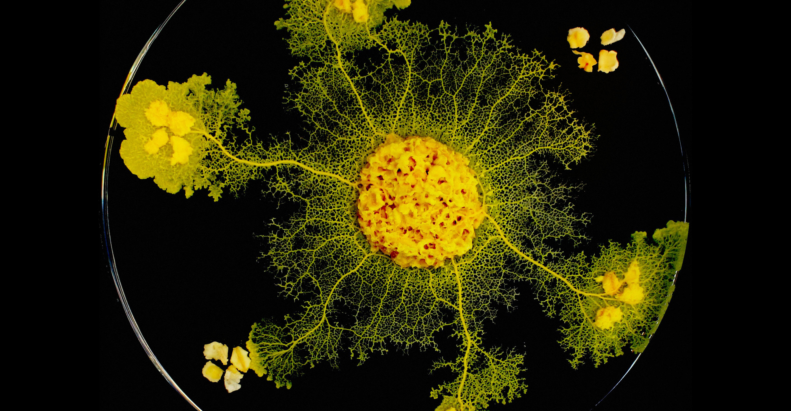
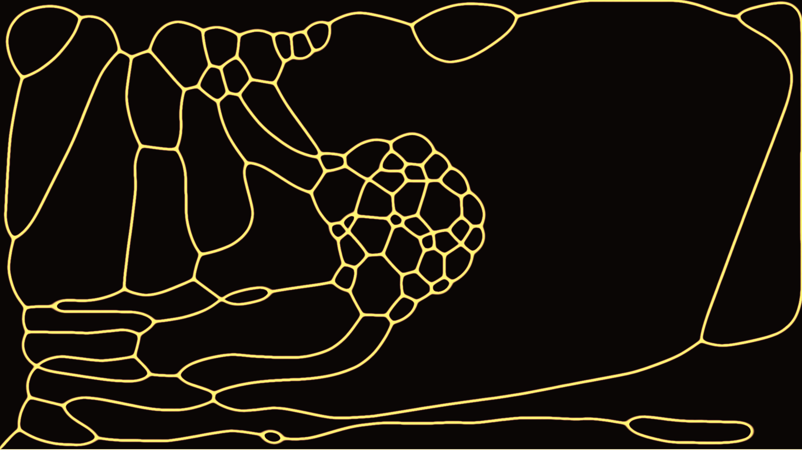
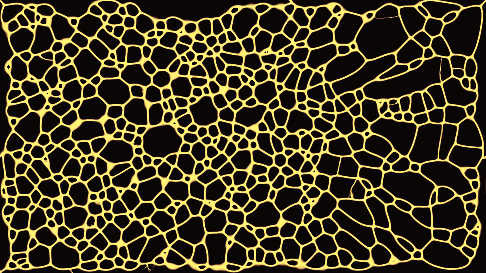
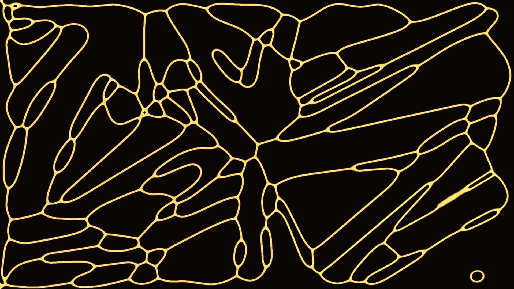

# Slime Mold Simulation

A gpu-accelerated (with the use of openGL compute shaders)
way to simulate slime molds.

This project also includes my own implementation of raw OpenGL 4 bindings as an attempt to learn more about how to work with low level OpenGL.

Simulation details inspired by [this blogpost](https://cargocollective.com/sagejenson/physarum)

## Screenshots

Screenshots taken when adjusting various parameters.

